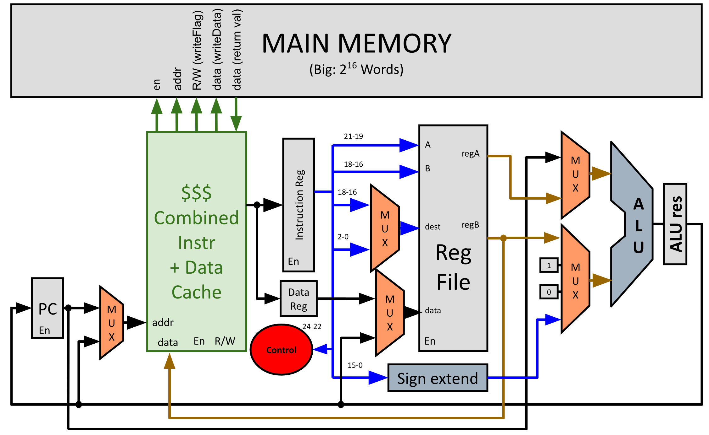
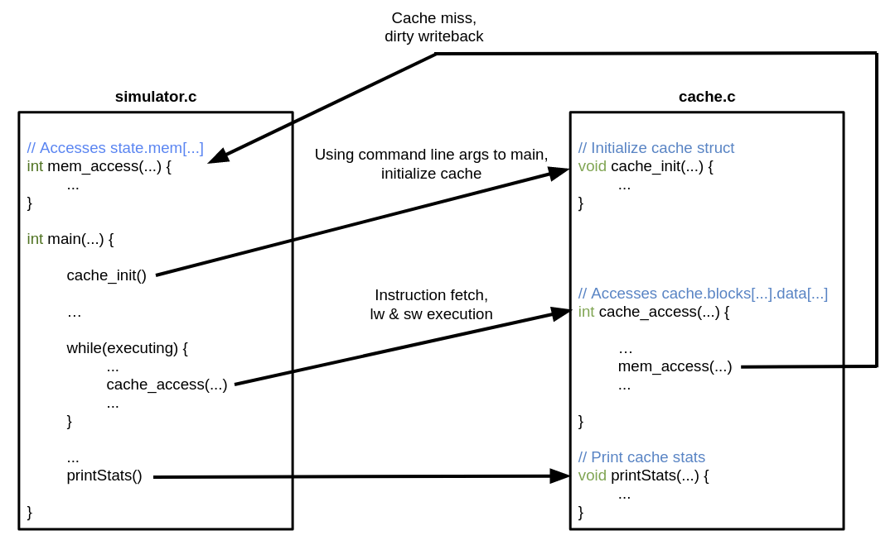

(proj descriptions and starter codes are not part of the license)

Project descriptions:

# Project 4 EECS 370 (Fall 2023)

| Worth:    | 100 points                                 |
| --------- | ------------------------------------------ |
| Assigned: | Thursday, November 2nd, 2023               |
| Due:      | 11:55 PM ET, Thursday, November 30th, 2023 |

# 0. Starter Code

[Starter code](https://eecs370.github.io/project_4_spec/starter_4.tar.gz) for project 4, the LC2K cache simulator.

# 1. Purpose

The purpose of this project is to teach you about cache design and how a caching processor generates and services address references.

# 2. Problem

In this project, you will simulate a CPU cache (unified instruction/data) and integrate the cache into a Project 1 (behavioral) simulator. As the processor simulator executes an assembly-language program, it will access instructions and data. These accesses will be serviced by the cache, which will transfer data to/from memory as needed.

# 3. Cache Simulator

The central part of this project is to write a function `cache_access` that implements a flexible cache simulator. The cache function will be used by the processor simulation when the processor accesses addresses. Your cache function should be able to simulate a variety of cache configurations. Once integrated into your processor simulator, the program will be run as follows:

|      | ./simulator program.mc blockSizeInWords numberOfSets blocksPerSet |
| ---- | ------------------------------------------------------------ |
|      |                                                              |

Your cache function should simulate a cache with the following characteristics:

1) **WRITE POLICY**: write-back, allocate-on-write
2) **ASSOCIATIVITY**: varies according to the `blocksPerSet` parameter. Associativity ranges from 1 (direct-mapped) to the number of blocks in the cache (fully associative).
3) **SIZE**: the total number of words in the cache is `blockSizeInWords` * `numberOfSets` * `blocksPerSet`
4) **BLOCK SIZE**: varies according to the `blockSizeInWords` parameter. All transfers between the cache and memory take place in units of a single block.
5) **PLACEMENT/REPLACEMENT POLICY**: when looking for a block within a set to replace, the best block to replace is an invalid (empty) block. If there is none of these, replace the least-recently used block.

Make sure the units of each parameter are as specified. Note that the smallest data granularity in this project is a word, because this is the data granularity of the LC2K architecture. `blockSizeInWords`, `numberOfSets`, and `blocksPerSet` should all be powers of two. To simplify your program, you may assume that the maximum number of cache blocks is 256 and the maximum block size is 256 (these small numbers allow you to use a 2-dimensional array for the cache data structure, as in the starter code).

# 4. Origin and Servicing of Address References

As the processor executes an assembly-language program, it accesses addresses. The three sources of address references are instruction fetch, lw, and sw. When the program starts up, it will initialize the memory with the machine-code file as in [Project 1](https://eecs370.github.io/project_1_spec/). These initialization references should **NOT** call `cache_access`; they should simply set the initial memory state. Each address reference should be passed to the cache simulator. The cache simulator keeps track of what blocks are currently in the cache and what state they are in (e.g. dirty, valid, etc.). To service the address reference, the cache simulator may need to write back a dirty cache block to memory, then it may need to read a block into the cache from memory. After these possible steps, the cache simulator should return the data to the processor (for read accesses) or write the data to the cache (for write accesses). Each of these data transfers will be logged by calling the `printAction` function (don’t modify this code at all - but be sure to #include the correct headers. This is also included in the starter code).:

|      | //Use this when calling printAction. Do not modify the enumerated type below. |
| ---- | ------------------------------------------------------------ |
|      | enum actionType                                              |
|      | {                                                            |
|      | cacheToProcessor,                                            |
|      | processorToCache,                                            |
|      | memoryToCache,                                               |
|      | cacheToMemory,                                               |
|      | cacheToNowhere                                               |
|      | };                                                           |
|      | /*                                                           |
|      | * Log the specifics of each cache action.                    |
|      | *                                                            |
|      | * DO NOT modify the content below.                           |
|      | * address is the starting word address of the range of data being transferred. |
|      | * size is the size of the range of data being transferred.   |
|      | * type specifies the source and destination of the data being transferred. |
|      | *  -    cacheToProcessor: reading data from the cache to the processor |
|      | *  -    processorToCache: writing data from the processor to the cache |
|      | *  -    memoryToCache: reading data from the memory to the cache |
|      | *  -    cacheToMemory: evicting cache data and writing it to the memory |
|      | *  -    cacheToNowhere: evicting cache data and throwing it away |
|      | */                                                           |
|      | void printAction(int address, int size, enum actionType type) |
|      | {                                                            |
|      | printf("$$$ transferring word [%d-%d] ", address, address + size - 1); |
|      |                                                              |
|      | if (type == cacheToProcessor) {                              |
|      | printf("from the cache to the processor\n");                 |
|      | }                                                            |
|      | else if (type == processorToCache) {                         |
|      | printf("from the processor to the cache\n");                 |
|      | }                                                            |
|      | else if (type == memoryToCache) {                            |
|      | printf("from the memory to the cache\n");                    |
|      | }                                                            |
|      | else if (type == cacheToMemory) {                            |
|      | printf("from the cache to the memory\n");                    |
|      | }                                                            |
|      | else if (type == cacheToNowhere) {                           |
|      | printf("from the cache to nowhere\n");                       |
|      | } else {                                                     |
|      | printf("error: unrecognized action\n");                      |
|      | exit(1);                                                     |
|      | }                                                            |
|      | }                                                            |

# 5. Getting Started

The compiled executable for project 4 requires two files: one file containing a modified solution to project 1s, and one file that manages the cache called `cache.c`. The compiler will link these two files together to create the executable.

The project 1s solution still contains `main`, the logic to read in machine code files and perform operations for different instructions. For project 4, `main` will make calls to 3 functions in `cache.c`:

1) `cache_init`, which sets up the cache for later use. 2) `cache_access`, which services access requests for instruction fetches, loads, and stores. 3) `printStats`, which prints some extra debugging information and statistics on the terminal.

The project 1s solution also still includes the `stateType` definition from project 1s, which includes the memory array. To access the memory array, `cache.c` will make function calls to `mem_access`, which will be defined in the modified project 1s solution.

This picture below shows how the project 1s solution and `cache.c` interact:

There are two ways to complete this project: by modifying your project 1s `simulator.c` to link with your `cache.c`, or by using the instructor project 1s solution `inst_p1s_sim.o` to link with your `cache.c`. After downloading the starter code, rename `starter_cache.c` to `cache.c` before you begin to edit code.

## 5.1. Using the Instructor Project 1s Solution

The instructor project 1s solution `inst_p1s_sim.o` is a compiled version of the C code solution from project 1s, with the modifications listed above. You may assume it calls the 3 functions in `cache.c` as appropriate, and handles file reading and machine code execution properly. Compared to project 1s, the output is limited: `printState` is only called for the final state of the machine, and the number of memory accesses are printed at the end. This object file also has one modification to `printState`: If any `cacheToMem printAction` wrote to a memory location outside the memory defined in the machine code, `printState` will show these modifications. For example, if the input machine code contained 8 lines, and one `sw` writes to location `100`, and the cache line containing location `100` is written to memory, `printState` will print memory values from `0` to the highest address in the same cache block as location `100` . After downloading the starter code and renaming `starter_cache.c` to `cache.c`, you can compile `cache.c` with `inst_p1s_sim.o` using `gcc cache.c inst_p1s_sim.o -lm` and run the executable on an lc2k machine code file.

If you choose to use the instructor object file, beware of the following particulars: First, this object file is only officially supported on CAEN systems since it was compiled on a linux x86 system similar to the autograder servers. If you are not already in the habit of testing your projects on CAEN, it is recommended to follow [setup guide](https://eecs280staff.github.io/p1-stats/setup_caen) from EECS 280. Also, this object file does not contain debug information so that instructors can protect the instructor project 1s solution. This means that debugging with a visual debugger or GDB will only show you what is happening in your `cache.c`. It also does not call `printState` on every instruction executed, so print debugging will not be as helpful as if you use your project 1s code. Finally, if you choose to use the starter `Makefile`, make sure to change the compilation dependecies in there to link with the instructor project 1s solution.

## 5.2. Using Your Project 1s Solution

If you choose to modify your project 1s, your code should behave similarly to the original solution with a few exceptions so that it links with `cache.c` as defined above. You will not be turning in this code, so this is for your local testing only. Follow these steps to modify your project 1s solution.

1) Copy your project 1s solution `simulator.c` and rename it to `my_p1s_sim.c`.
2) Add the following lines near the top of `my_p1s_sim.c`, after the global `stateType` definition, and before `main`:

|      | extern void cache_init(int blockSize, int numSets, int blocksPerSet); |
| ---- | ------------------------------------------------------------ |
|      | extern int cache_access(int addr, int write_flag, int write_data); |
|      | extern void printStats();                                    |
|      | static stateType state;                                      |
|      | static int num_mem_accesses = 0;                             |
|      | int mem_access(int addr, int write_flag, int write_data) {   |
|      | ++num_mem_accesses;                                          |
|      | if (write_flag) {                                            |
|      | state.mem[addr] = write_data;                                |
|      | if(state.numMemory <= addr) {                                |
|      | state.numMemory = addr + 1;                                  |
|      | }                                                            |
|      | }                                                            |
|      | return state.mem[addr];                                      |
|      | }                                                            |
|      | int get_num_mem_accesses(){                                  |
|      | return num_mem_accesses;                                     |
|      | }                                                            |

If `state` is declared in main or somewhere else, remove that declaration.

3) Change the command line argument handling near the top of `main` so that it can accept cache parameters as detailed in [Section 3](https://eecs370.github.io/project_4_spec/#3-cache-simulator). After taking in these command line arguments, pass them to the cache with a call to `cache_init`.
4) For instruction fetches, loads, and stores, replace accesses to `state.mem` with function calls to `cache_access`.
5) Upon a halt instruction, after printing the final state of the processor, make a function call to `printStats`.
6) At this point, if you can compile `cache.c` with `my_p1s_sim.c` using `gcc cache.c my_p1s_sim.c -lm` and run the executable on assembled lc2k machine code. It is recommended to do this for at least one test case from project 1s so that you can see if it runs correctly.
7) Modify output to match what the instructor solution outputs. This is not required, but will greatly aid in debugging. Remove calls to `printState` except for the final state. Print the `num_mem_accesses` after printing the final state. See [Section 9](https://eecs370.github.io/project_4_spec/#9-sample-assembly-language-program-and-output) for an example of what output the autograder will see.

## 5.3. Hints for Either Option

For either method, note that `starter_cache.c` linked with either `my_p1s_sim.c` or `inst_p1s_sim.o` will provide a near-complete version of project 1s, without many of the printed states, and with some statistics printed. It might be helpful to run the starter solution on some of your project 1s test cases to see how that works.

For either method, you will not be submitting a project 1s solution to the autograder. Your `cache.c` should work properly with any proper `my_p1s_sim.c` and `inst_p1s_sim.o`. If you are struggling with one of the above options, try using the other.

# 6. Test Cases

An integral (and graded) part of writing your cache simulator will be to write a suite of test cases to validate any LC2K cache simulator. This is common practice in the real world–software companies maintain a suite of test cases for their programs and use this suite to check the program’s correctness after a change. Writing a comprehensive suite of test cases will deepen your understanding of the project specification and your program, and it will help you a lot as you debug your program.

The test cases for this project will be short assembly-language programs that, after being assembled into machine code, serve as input to a simulator. You will submit your suite of test cases together with your cache simulator, and we will grade your test suite according to how thoroughly it exercises an LC2K cache simulator. Each test case may be at most 50 lines (as this is the limit for the project 1a assembler) and may execute at most 10000 instructions on a correct simulator, and your test suite may contain up to 20 test cases. These limits are much larger than needed for full credit.

Your test cases MUST assemble as well as halt within 10000 instructions. We encourage you to run your test cases on your project 1 simulator prior to submitting to ensure they halt.

Each test case will specify the cache parameters to use when running the test case. These parameters will be communicated via the name of the test case file. Each test case should have a 3-part suffix, where each part identifies a cache parameter and the parts are separated by periods:

|      | <alphaNumeric>.<blockSizeInWords>.<numberOfSets>.<blocksPerSet>.<fileExtension> |
| ---- | ------------------------------------------------------------ |
|      |                                                              |

For example, the test case in [Section 9](https://eecs370.github.io/project_4_spec/#9-sample-assembly-language-program-and-output) would be named `p4spec.4.2.1.as`. The combination of cache parameters should be legal, meaning that they should all be nonzero powers of 2, and not require a block size or number of blocks exceeding 256 (i.e. `blockSizeInWords` and `numberOfSets*blocksPerSet` should not exceed 256). Do not include spaces, extra periods, or anything besides alphanumeric characters or underscores or periods in your file names.

Writing good test cases for this project will require careful planning. Think about what different types of behavior a cache can exhibit and generate test cases that cause the cache to exhibit each behavior. Think about how to test the various algorithms used in the cache simulator, e.g. LRU, writebacks, read and write hits, read and write misses. As you write the code for your simulator, keep notes on different conditions you think of, and write test cases to test those conditions. The instructor buggy simulators will not have error-checking bugs. See [Section 7](https://eecs370.github.io/project_4_spec/#7-grading-auto-grading-and-formatting) for how your test suite will be graded.

# 7. Grading, Auto-Grading, and Formatting

We will grade on the correctness of your cache simulator and the comprehensiveness of your test suite.

Only output from the calls to `printAction`, `printState` (from from the project 1s simulator), and the reported number of memory accesses performed will be graded for correctness and must match the expected output exactly. This means that any lines not containing `$$$`, or between `@@@` and `end state` will be ignored. Note that the only graded output in `cache.c` comes from `printAction` - other graded output is generated by the simulator portion from project 1s.

To help you validate your project, your submission will be graded automatically. You may then continue to work on the project and re-submit. There is a limit of **3** submissions per day with feedback, all other submissions will be recorded but you will not receive feedback until after the deadline.

The results from the auto-grader will not be very illuminating; they won’t tell you where your problem is or give you the test programs. The purpose of the auto-grader is to help you know that you need to keep working on your project (rather than thinking it’s perfect and ending up with a 0). The best way to debug your program is to generate your own test cases, figure out the correct answers, and compare your program’s output to the correct answers. This is also one of the best ways to learn the concepts in the project.

The student suite of test cases for the simulator will be graded according to how thoroughly they test a cache simulator. We will judge thoroughness of the test suite by how many potential bugs in a cache simulator are exposed. The auto-grader will correctly assemble each valid test case in your suite, then use it as input to a set of buggy simulators. A test case exposes a buggy simulator by causing it to generate a different answer from a correct simulator. The test suite is graded based on how many of the buggy simulators were exposed by at least one test case. There are 18 buggy simulators, each worth 3/4 points. The maximum points available for catching buggy solutions is 12 points, so you will need to catch 16/18 bugs for full credit.

Because all programs will be auto-graded, you must be careful to follow the exact formatting rules in the project description:

1) Don’t modify `printAction` at all. Download the starter code into your program electronically (don’t re-type it) so you avoid typos.
2) Check your program’s output on the sample assembly-language program and output at the end of this handout. This one test will also be visible in the autograder.
3) Don’t print the sequences `$$$` or `@@@` anywhere except in `printAction()`. Any line containing `$$$` will be graded, as well as any lines between `@@@` and `end state` (inclusive). You may find the [Project 1 printState function](https://eecs370.github.io/project_1_spec/) or the provided `printCache()` function useful in debugging, but make sure there are no extra `@@@` or `$$$` strings.

Ensure that test case names include alphanumeric characters, underscores, and periods ONLY

# 8. Turning in the Project

Use [autograder.io](https://autograder.io/web/course/197) to submit your files. You have been added as a student to the class, so you should see EECS 370 listed as a class.

You will submit the following files to the autograder:

- Your cache simulator, a C program named `cache.c`
- Suite of test cases (each test case is an assembly-language program in a separate file, ending in “.as”, “.s”, or “.lc2k”). Each test case should have a suffix which tells the auto-grader which cache parameters should be used when running that test case (see [Section 6](https://eecs370.github.io/project_4_spec/#6-test-cases)). Test case names should only include alphanumeric characters, underscores, and periods.

Your cache must be in a single C file. We will compile your program on a Linux workstation using `gcc cache.c inst_p1s_sim.o -lm`, so your program should not require additional compiler flags or libraries. Standard library headers do not require additional compiler flags or libraries. The official time of submission for your project will be the time the last file is sent. If you send in anything after the due date, your project will be considered late (and will use up your late days or will incur a penalty in your grade).

# 9. Sample Assembly-Language Program and Output

Here is a sample assembly-language program `p4spec.4.2.1.as` included in the starter code:

Spec example test case

|      | sw  	0   	1   	6  |
| ---- | -------------------------- |
|      | lw  	0   	1   	23 |
|      | lw  	0   	1   	30 |
|      | halt                       |
|      |                            |

and its corresponding output with the following cache parameters: `blockSizeInWords = 4`, `numberOfSets = 2`, and `blocksPerSet = 1`. This output is also included in the starter code folder. Make sure you understand each of the data transfers and their order. Again, see [Section 7](https://eecs370.github.io/project_4_spec/#7-grading-auto-grading-and-formatting) to know which lines are graded, and which are there to help you in debugging.

|      | Simulating a cache with 2 total lines; each line has 4 words |
| ---- | ------------------------------------------------------------ |
|      | Each set in the cache contains 1 lines; there are 2 sets     |
|      | $$$ transferring word [0-3] from the memory to the cache     |
|      | $$$ transferring word [0-0] from the cache to the processor  |
|      | $$$ transferring word [4-7] from the memory to the cache     |
|      | $$$ transferring word [6-6] from the processor to the cache  |
|      | $$$ transferring word [1-1] from the cache to the processor  |
|      | $$$ transferring word [4-7] from the cache to the memory     |
|      | $$$ transferring word [20-23] from the memory to the cache   |
|      | $$$ transferring word [23-23] from the cache to the processor |
|      | $$$ transferring word [2-2] from the cache to the processor  |
|      | $$$ transferring word [20-23] from the cache to nowhere      |
|      | $$$ transferring word [28-31] from the memory to the cache   |
|      | $$$ transferring word [30-30] from the cache to the processor |
|      | $$$ transferring word [3-3] from the cache to the processor  |
|      | machine halted                                               |
|      | final state of machine:                                      |
|      |                                                              |
|      | @@@                                                          |
|      | state:                                                       |
|      | pc 4                                                         |
|      | memory:                                                      |
|      | mem[ 0 ] 12648454                                            |
|      | mem[ 1 ] 8454167                                             |
|      | mem[ 2 ] 8454174                                             |
|      | mem[ 3 ] 25165824                                            |
|      | mem[ 4 ] 0                                                   |
|      | mem[ 5 ] 0                                                   |
|      | mem[ 6 ] 0                                                   |
|      | mem[ 7 ] 0                                                   |
|      | registers:                                                   |
|      | reg[ 0 ] 0                                                   |
|      | reg[ 1 ] 0                                                   |
|      | reg[ 2 ] 0                                                   |
|      | reg[ 3 ] 0                                                   |
|      | reg[ 4 ] 0                                                   |
|      | reg[ 5 ] 0                                                   |
|      | reg[ 6 ] 0                                                   |
|      | reg[ 7 ] 0                                                   |
|      | end state                                                    |
|      | $$$ Main memory words accessed: 20                           |
|      | End of run statistics:                                       |
|      | hits 3, misses 4, writebacks 1                               |
|      | 0 dirty cache blocks left                                    |
|      |                                                              |